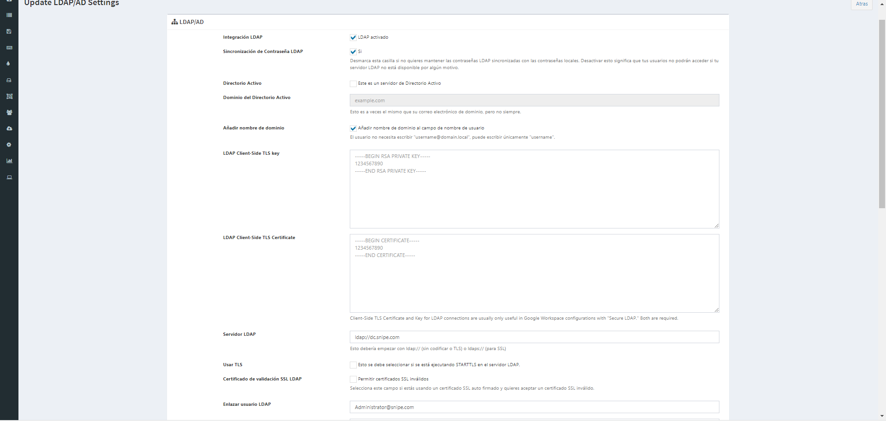

# Instalacion y Configuracion de Snipe-IT en un CentOs 8 Stream

## Paginas consultadas 
[How To Install Snipe-IT Asset Management on CentOS 8](https://computingforgeeks.com/install-snipe-it-asset-management-on-centos-8-linux/)


## Prerequisitos

- Tener instalado un gestor de base de datos(utilizaremos MariaDB)
- Tener instalado PHP 7.4
- Tener instalado PHP composer

No pasa nada, si no sabes instalarlos antes de comenzar con la instalacion de Snipe-IT, vamos a instalarlos. En caso de que tengas todos los prerequisitos, puedes saltarte esta parte, haciendo click [aqui](##Prerequisitos)


## Instalacion de PHP y los modulos.

Lo primero que tenomos que hacer es añadir el repositorio de EPEL y REMI para que PHP pueda instalar los modulos necesarios.

```bash
sudo yum -y install https://dl.fedoraproject.org/pub/epel/epel-release-latest-8.noarch.rpm
sudo yum -y install https://rpms.remirepo.net/enterprise/remi-release-8.rpm
```

Una vez añadidos los repositorios tenemos que instalar las dnf-utils para que podamos instalar PHP 7.4.

```bash
sudo dnf -y install dnf-utils
```
Y activamos el modulo para PHP 7.4.

```bash
sudo dnf module reset php -y
sudo dnf module install php:remi-7.4 -y
```

Una vez instalado el modulo tenemos que instalar los paquetes adicionales para PHP 7.4.

```bash
sudo dnf update
sudo yum install php-xxx
```

Y podemos comprobar como la version de PHP es la correcta.

```bash 
php -v
```

Para ver los modulos que estan activados usamos el comando:

      
```bash
php --modules
```


## Instalar MariaDB

Una vez instalado PHP 7.4, tenemos que instalar MariaDB.


Lo primero que tenemos que hacer es actualizar el sistema.
```bash
sudo dnf -y update
```

Ahora necesitamos añadir el repositorio de MariaDB.

```bash
curl -LsS -O https://downloads.mariadb.com/MariaDB/mariadb_repo_setup
sudo bash mariadb_repo_setup --mariadb-server-version=10.6
```

Tras haber instalado los repositorios, tenemos que instalar MariaDB.

```bash
sudo dnf install boost-program-options -y
sudo dnf module reset mariadb -y
sudo yum install MariaDB-server MariaDB-client MariaDB-backup
sudo systemctl enable --now mariadb
```

Y para que MariaDB, se inicie al iniciar el sistema, tenemos que añadir el comando:

```bash
sudo systemctl enable mariadb
```

Ahora configuramos MariaDB.

```bash
sudo mariadb-secure-installation
NOTE: RUNNING ALL PARTS OF THIS SCRIPT IS RECOMMENDED FOR ALL MariaDB
      SERVERS IN PRODUCTION USE!  PLEASE READ EACH STEP CAREFULLY!

In order to log into MariaDB to secure it, we'll need the current
password for the root user.  If you've just installed MariaDB, and
you haven't set the root password yet, the password will be blank,
so you should just press enter here.

Enter current password for root (enter for none): 
OK, successfully used password, moving on...

Setting the root password ensures that nobody can log into the MariaDB
root user without the proper authorisation.

Set root password? [Y/n] y
New password: 
Re-enter new password: 
Password updated successfully!
Reloading privilege tables..
 ... Success!

By default, a MariaDB installation has an anonymous user, allowing anyone
to log into MariaDB without having to have a user account created for
them.  This is intended only for testing, and to make the installation
go a bit smoother.  You should remove them before moving into a
production environment.

Remove anonymous users? [Y/n] y
 ... Success!

Normally, root should only be allowed to connect from 'localhost'.  This
ensures that someone cannot guess at the root password from the network.

Disallow root login remotely? [Y/n] y
 ... Success!

By default, MariaDB comes with a database named 'test' that anyone can
access.  This is also intended only for testing, and should be removed
before moving into a production environment.

Remove test database and access to it? [Y/n] y
 - Dropping test database...
 ... Success!
 - Removing privileges on test database...
 ... Success!

Reloading the privilege tables will ensure that all changes made so far
will take effect immediately.

Reload privilege tables now? [Y/n] y
 ... Success!

Cleaning up...

All done!  If you've completed all of the above steps, your MariaDB
installation should now be secure.

Thanks for using MariaDB!
```

Podemos testear que esta bien configurado con el comando:

```bash
sudo mysql -u root -p
```

Y una vez dentro podemos consultar la version de MariaDB.

```bash
select version();
quit
```


## Instalacion PHP composer

Lo primero que tenemos que hacer es descargar el PHP composer. Lo instalaremos directamente en /usr/local/bin/composer.


```bash	
sudo php composer-installer.php --filename=composer --install-dir=/usr/local/bin 
```

Podemos comprobar que esta bien instalado con el comando:

```bash
composer --version
```

---

## Instalacion de Snipe-IT

Una vez tenemos instalados todos los prerequisitos, podemos instalar Snipe-IT.

Lo primero que hacer es actualizar el sistema y instalar git y añadir el repsotorio de EPEL.
```bash
sudo dnf -y update

sudo dnf -y install epel-release git
```

Una vez instalado git y el repositorio de EPEL, tenemos que instalar el servidor web Apache.

```bash
sudo dnf -y install httpd
```

Y arrancar el apache para que se inicie al iniciar el sistema.

```bash
sudo systemctl start httpd
sudo systemctl enable httpd
```

Con el apache ya instalado tenemos que instalar los modulos de PHP.

```bash
sudo dnf -y install php-openssl php-pdo php-mbstring php-tokenizer php-curl php-mysqli php-ldap php-zip php-fileinfo php-gd php-dom php-bcmath
```

Tambien debemos de iniciar MariaDB.(en caso de que no este iniciada)

```bash
sudo systemctl start mariadb
sudo systemctl enable mariadb
```

Ahora con MariaDB iniciada, tenemos que crear la base de datos que va a utilizar Snipe-IT.

```bash
mysql -u root -p
```

Una vez dentro tenemos que ejecutar los siguientes comandos:

```bash
CREATE DATABASE snipeit;
CREATE USER 'snipeit'@'localhost' IDENTIFIED BY 'Je1eimom4chahth';  # La contraseña puede ser la que quieras, al igual que el nombre de usuario
GRANT ALL PRIVILEGES ON snipeit.* TO 'snipeit'@'localhost';
FLUSH PRIVILEGES;
EXIT;
```

Una vez creada la base de datos, podemos instalar Snipe-IT. Tenemos que clonar el repositorio de github, y ya declaramos la ruta donde queremos que se clone.

```bash
sudo git clone https://github.com/snipe/snipe-it /var/www/html/snipe
```

Ahora tenemos que configurar Snipe-IT.

```bash
cd /var/www/html/snipe
sudo cp .env.example .env
```

Hacemos esto para copiar el archivo de configuracion de Snipe-IT por defecto y poder modificarlo sin peligro alguno.

```bash
$ sudo vim .env

APP_URL=example.com           # La IP o nombre FQDN de la maquina.
APP_TIMEZONE='UTC'            # Hora que quieras que se utilice.
DB_DATABASE=snipeit           # Nombre de la base de datos.
DB_USERNAME=snipeit           # Nombre del usuario que has creado en MariaDB.
DB_PASSWORD=Je1eimom4chahth   # Contraseña del usuario que has creado en MariaDB.
```

Ahora tenemos que dar los permisos necesarios para que funcione Snipe-IT.

```bash
sudo chown -R apache:apache storage public/uploads
sudo chmod -R 755 storage
sudo chmod -R 755 public/uploads
```

Ahora instalaremos las dependncias de PHP utilizando el comando composer.

```bash
sudo /usr/local/bin/composer install --no-dev --prefer-source
```

Y tenemos que generar un APP_KEY para que funcione Snipe-IT.

```bash
sudo php artisan key:generate
Do you really wish to run this command? (yes/no) [no]:
  > yes 
```

La APP_KEY se añade en el archivo .env automaticamente.

Una vez configurado todo lo anterior tenemos que configurar apache.

Lo primero que hay que hacer es añadir una excepcion en el firewall.

```bash
sudo firewall-cmd --permanent --add-service=http
sudo firewall-cmd --reload
```

Ahora nos moveremos a la carpeta de configuracion de apache para mayor comodidad.

```bash
cd /etc/httpd/conf.d/
```

Una vez dentro de esta carpeta creamos un archivo para que apache pueda cargar la pagina de Snipe-IT.

```bash
$ sudo vim geeksnipe.conf ## El nombre puede ser cualquiera.
<VirtualHost *:80>
  ServerName example.com ## La misma que hemos puesto en el archivo .env
  DocumentRoot /var/www/html/snipe/public
  <Directory  /var/www/html/snipe/public>
    Options Indexes FollowSymLinks Multiviews
    AllowOverride All
    Order allow,deny
    allow from all
  </Directory>
</VirtualHost>
```

Guardamos el archivo y reiniciamos apache.

```bash
sudo systemctl restart httpd
```

Ahora configuraremos SELinux.

```bash
sudo yum provides /usr/sbin/semanage
```

Instalamos un paquete de SELinux.

```bash
sudo yum install policycoreutils-python-utils
```

Y ejecutamos los siguientes comandos.

```bash
sudo semanage fcontext -a -t httpd_sys_rw_content_t " /var/www/html/snipe(/.*)/?"
sudo restorecon -R -v  /var/www/html/snipe/
sudo semanage fcontext -a -t httpd_sys_rw_content_t "/var/www/html/snipe/storage(/.*)?"
sudo restorecon -RF /var/www/html/snipe/storage
```

Y por ultimo ejecutamos el comando:
      
```bash
sudo setsebool -P httpd_can_network_connect on
```

En caso de que al intentar iniciar la pagina desde un navegador nos de un error de "Internal Server Error", ejecutaremos el siguiente comando:

```bash
sudo setenforce 0
sudo systemctl restart httpd
```


Ahora podemos probar que todo funciona correctamente, entrando a la pagina web con la direccion ip o nombre FQDN del archivo .env. Te pedira configurar unas cosas basicas y luego accederas a una interfaz de administracion de Snipe-IT.


Tambien podemos añadir una conexion con LDAP, esto se hace desde la rueda de adminisracion de Snipe-IT(arriba a la derecha) y luego seleccionamos LDAP.

Y nos aparecera una pagina como esta; debemos de añadir los datos de nuestro servidor LDAP.

